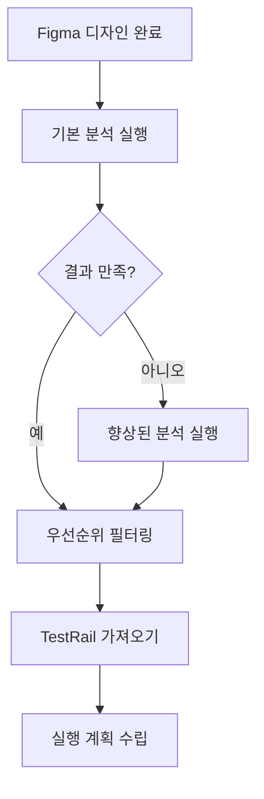

# 🚀 Figma QA TestCase Generator - 사용법 가이드

> **AI 기반 Figma 분석을 통한 자동 테스트케이스 생성 도구**  
> 거래소 QA 엔지니어를 위한 완전 가이드

---

## 📋 목차
1. [⚡ 5분 빠른 시작](#-5분-빠른-시작)
2. [🔧 3가지 사용법](#-3가지-사용법)
3. [💼 실무 활용 시나리오](#-실무-활용-시나리오)
4. [⚙️ 설정 및 커스터마이징](#️-설정-및-커스터마이징)
5. [🚨 문제 해결](#-문제-해결)
6. [💡 팁과 베스트 프랙티스](#-팁과-베스트-프랙티스)

---

## ⚡ 5분 빠른 시작

### 1️⃣ 환경 설정 (1분)

```bash
# 프로젝트 클론
git clone https://github.com/rowroh/figma-qa-testcase-generator.git
cd figma-qa-testcase-generator

# 가상환경 활성화 (이미 있는 경우)
source /Users/rowroh/Documents/testcase/figma_env/bin/activate

# 의존성 설치
pip install -r requirements.txt
```

### 2️⃣ Figma 토큰 설정 (2분)

```bash
# 환경 파일 생성
cp config/env_example.txt .env

# Figma 토큰 추가 (실제 토큰으로 변경)
echo "FIGMA_TOKEN=figd_your_actual_token_here" > .env
```

**🔑 Figma 토큰 발급:**
1. [Figma 설정](https://www.figma.com/settings) → Personal access tokens
2. "Create new token" → 이름: "QA TestCase Generator" 
3. 생성된 토큰을 복사하여 `.env` 파일에 추가

### 3️⃣ 첫 번째 실행 (2분)

```bash
# 샘플 분석 실행
python src/main.py "https://www.figma.com/design/your-figma-url" --verbose

# 결과 확인
ls -la output/
```

**🎉 완료! 이제 본격적으로 사용해보세요.**

---

## 🔧 3가지 사용법

### 🚀 방법 1: CLI (명령행) - **가장 추천**

#### 기본 사용법

```bash
python src/main.py [FIGMA_URL] [옵션들]
```

#### 실무 예제

```bash
# 1. 기본 Excel 출력
python src/main.py "https://figma.com/design/project-url"

# 2. TestRail 가져오기용 CSV
python src/main.py "https://figma.com/design/project-url" \
  --format testrail \
  --output "testrail_import.csv"

# 3. P1 우선순위만 생성
python src/main.py "https://figma.com/design/project-url" \
  --priority P1 \
  --output "critical_tests.xlsx" \
  --verbose

# 4. 빠른 분석 (스크린샷 제외)
python src/main.py "https://figma.com/design/project-url" \
  --analysis basic \
  --no-screenshot

# 5. JSON API 연동용
python src/main.py "https://figma.com/design/project-url" \
  --format json \
  --output "api_testcases.json"
```

#### 옵션 설명

| 옵션 | 설명 | 예시 |
|------|------|------|
| `--output`, `-o` | 출력 파일 경로 | `-o results.xlsx` |
| `--format`, `-f` | 출력 형식 (excel/testrail/json) | `-f testrail` |
| `--analysis`, `-a` | 분석 유형 (basic/enhanced) | `-a enhanced` |
| `--priority`, `-p` | 우선순위 필터 (P1/P2/P3/P4) | `-p P1` |
| `--no-screenshot` | 스크린샷 분석 제외 | |
| `--verbose`, `-v` | 상세 출력 | |

#### CLI 실행 결과 예시

```
🚀 Figma QA TestCase Generator
==================================================
🔍 Figma 분석기 초기화 중...
🔬 향상된 분석 실행 중...

📋 분석 결과 요약:
  총 요소 수: 47
  UI 복잡도: high
  주요 플로우: authentication
  감지된 UI 패턴: 8

📝 테스트케이스 생성 중...
✅ 완료!
📁 파일: X_OAuth_TestCases.xlsx
📊 테스트케이스: 35개

📈 우선순위별 분포:
    P1: 12개
    P2: 15개
    P3: 8개
```

---

### 🔧 방법 2: Python API - **고급 활용**

#### 기본 사용법

```python
from src.analyzers.figma_analyzer import FigmaAnalyzer
from src.generators.testcase_generator import TestCaseGenerator
from dotenv import load_dotenv

# 환경변수 로드
load_dotenv()

# 1. 분석기 초기화
analyzer = FigmaAnalyzer()
generator = TestCaseGenerator()

# 2. Figma 분석
figma_url = "https://www.figma.com/design/project-url"
result = analyzer.enhanced_analysis(figma_url)

# 3. 테스트케이스 생성
if result.get("success"):
    testcases = generator.generate_from_analysis(result)
    
    # 4. 파일 저장
    generator.save_to_excel(testcases, "output.xlsx")
    print(f"✅ {len(testcases)}개 테스트케이스 생성 완료")
else:
    print(f"❌ 분석 실패: {result.get('error')}")
```

#### 일괄 처리 예제

```python
def batch_analysis(figma_urls, project_name="batch"):
    """여러 Figma URL 일괄 분석"""
    analyzer = FigmaAnalyzer()
    generator = TestCaseGenerator()
    
    all_testcases = []
    
    for i, url in enumerate(figma_urls):
        print(f"📊 분석 중 ({i+1}/{len(figma_urls)}): {url}")
        
        result = analyzer.enhanced_analysis(url)
        if result.get("success"):
            testcases = generator.generate_from_analysis(result)
            all_testcases.extend(testcases)
    
    # 결과 저장
    output_file = f"batch_{project_name}.xlsx"
    generator.save_to_excel(all_testcases, output_file)
    
    return len(all_testcases)

# 사용 예제
urls = [
    "https://figma.com/design/login-flow",
    "https://figma.com/design/trading-flow",
    "https://figma.com/design/withdrawal-flow"
]

total = batch_analysis(urls, "exchange_flows")
print(f"✅ 총 {total}개 테스트케이스 생성")
```

---

### 💬 방법 3: MCP 서버 - **대화식 학습**

#### 서버 실행

```bash
# 기존 MCP 서버 실행 (상위 디렉토리)
cd /Users/rowroh/Documents/testcase
source figma_env/bin/activate
python mcp_figma_server.py
```

#### 주요 기능

1. **키워드 학습**: 새로운 Figma URL에서 키워드 자동 추출 및 등록
2. **대화식 분석**: 실시간 피드백과 함께 단계별 분석
3. **향상된 분석**: 키워드 + 스크린샷 + 유저플로우 종합 분석
4. **TestRail 출력**: 바로 가져오기 가능한 형식 생성

#### 사용 예제

```
👤 사용자: "@https://figma.com/design/new-feature 키워드 등록해줘"
🤖 시스템: "✅ 47개 키워드 추출 및 등록 완료"

👤 사용자: "향상된 분석으로 테스트케이스 생성해줘"  
🤖 시스템: "📝 25개 테스트케이스 생성 완료. TestRail 형식으로 저장할까요?"

👤 사용자: "TO-BE 섹션만 분석해줘"
🤖 시스템: "🔍 TO-BE 분석 완료. 12개 신규 테스트케이스 식별"
```

---

## 💼 실무 활용 시나리오

### 🆕 신기능 출시 준비

**상황**: 새로운 X OAuth 연동 기능 출시  
**목표**: 핵심 테스트케이스만 빠르게 생성

```bash
# P1 우선순위 중심 분석
python src/main.py "https://figma.com/design/x-oauth-feature" \
  --priority P1 \
  --output "x_oauth_critical.xlsx" \
  --verbose

# TestRail에 바로 가져오기
python src/main.py "https://figma.com/design/x-oauth-feature" \
  --format testrail \
  --output "testrail_x_oauth.csv"
```

**결과**: P1 테스트케이스 12개로 핵심 기능 검증 완료

### 🔄 회귀 테스트 계획

**상황**: 거래소 주요 플로우 회귀 테스트 준비  
**목표**: 전체 플로우에 대한 포괄적 테스트 스위트 생성

```python
# 주요 플로우 일괄 분석
flows = [
    "https://figma.com/design/login-signup-flow",
    "https://figma.com/design/trading-flow", 
    "https://figma.com/design/withdrawal-flow",
    "https://figma.com/design/kyc-flow"
]

total = batch_analysis(flows, "regression_q4")
# 결과: 총 145개 테스트케이스 생성
```

### 📋 TO-BE 분석 및 GAP 식별

**상황**: 기존 기능 개선 후 변경사항 분석  
**목표**: 신규/변경된 테스트케이스 식별

```bash
# 1. 기존 상태 (AS-IS) 분석
python src/main.py "https://figma.com/design/current-login" \
  --output "as_is_login.xlsx"

# 2. 개선 상태 (TO-BE) 분석  
python src/main.py "https://figma.com/design/improved-login" \
  --output "to_be_login.xlsx"

# 3. MCP 서버로 GAP 분석
# "TO-BE 섹션 분석해줘" → 자동으로 변경사항 식별
```

### 📱 크로스 플랫폼 테스트

**상황**: 모바일 앱과 웹 동시 출시  
**목표**: 플랫폼별 특화 테스트케이스 생성

```bash
# 모바일 특화 키워드로 분석
python src/main.py "https://figma.com/design/mobile-app" \
  --output "mobile_tests.xlsx"

# 웹 특화 키워드로 분석  
python src/main.py "https://figma.com/design/web-app" \
  --output "web_tests.xlsx"
```

---

## ⚙️ 설정 및 커스터마이징

### 📄 환경변수 설정 (.env)

```bash
# 필수 설정
FIGMA_TOKEN=figd_your_actual_token_here

# 기본값 설정
DEFAULT_PRIORITY=P2
DEFAULT_TEST_TYPE=Functional
DEFAULT_DOMAIN=app
DEFAULT_OUTPUT_FORMAT=excel

# 분석 옵션
ENABLE_SCREENSHOT_ANALYSIS=true
ENABLE_ENHANCED_KEYWORDS=true
REQUEST_TIMEOUT=30
MAX_RETRY_ATTEMPTS=3

# 로깅
LOG_LEVEL=INFO
LOG_FILE=logs/figma_qa_generator.log
```

### 🔤 팀 특화 키워드 추가

```json
// config/keywords.json 수정
{
  "trading_keywords": [
    "매수", "매도", "거래", "주문", "체결", "호가", "차트",
    "포지션", "레버리지", "마진", "선물", "옵션"
  ],
  "security_keywords": [
    "로그인", "회원가입", "본인인증", "OTP", "생체인증", 
    "PIN", "패스워드", "2FA", "KYC", "AML"
  ],
  "wallet_keywords": [
    "지갑", "입금", "출금", "송금", "잔고", "자산", 
    "포트폴리오", "스테이킹", "콜드월렛", "핫월렛"
  ],
  "custom_keywords": [
    "NFT", "DeFi", "스왑", "브릿지", "런치패드", "에어드랍"
  ]
}
```

### 🎨 테스트케이스 템플릿 커스터마이징

```python
# 팀 표준에 맞게 수정
TESTCASE_TEMPLATES = {
    "title_format": "[{domain}] {feature} - {scenario}",
    "priority_rules": {
        "거래|매수|매도": "P1",
        "로그인|보안": "P1", 
        "입출금": "P2",
        "차트|정보조회": "P3"
    }
}
```

---

## 🚨 문제 해결

### 🔐 토큰 관련 문제

#### ❌ "FIGMA_TOKEN이 설정되지 않았습니다"

```bash
# 1. .env 파일 확인
cat .env

# 2. 올바른 토큰 설정
echo "FIGMA_TOKEN=figd_실제토큰값" > .env

# 3. 토큰 유효성 테스트
curl -H "X-FIGMA-TOKEN: your_token" "https://api.figma.com/v1/me"
```

#### ❌ "Figma 파일에 접근할 수 없습니다"

**해결책:**
1. Figma 파일 공유 설정 확인 (Anyone with link can view)
2. 새로운 토큰 발급
3. 파일 URL 형식 확인

### 🌐 분석 관련 문제

#### ⚠️ "생성된 테스트케이스가 없습니다"

```bash
# 1. 상세 로그로 원인 파악
python src/main.py "figma-url" --verbose

# 2. 기본 분석으로 시도
python src/main.py "figma-url" --analysis basic

# 3. 키워드 매칭 확인
grep -i "login\|button\|input" config/keywords.json
```

#### ⚠️ "UI 복잡도가 'unknown'"

```bash
# 향상된 분석 강제 실행
python src/main.py "figma-url" --analysis enhanced --verbose

# 스크린샷 분석 포함 확인
python src/main.py "figma-url" # 기본적으로 포함됨
```

### 💾 파일 관련 문제

#### ❌ "Permission denied"

```bash
# 출력 디렉토리 권한 설정
mkdir -p output
chmod 755 output

# 다른 위치에 저장
python src/main.py "figma-url" --output "/tmp/testcases.xlsx"
```

#### ❌ "ModuleNotFoundError"

```bash
# 가상환경 활성화 확인
which python
# 결과: /path/to/figma_env/bin/python 이어야 함

# 의존성 재설치
pip install -r requirements.txt --force-reinstall
```

### 🔧 성능 최적화

#### 분석 속도가 느릴 때

```bash
# 1. 기본 분석 사용 (50% 빠름)
python src/main.py "figma-url" --analysis basic

# 2. 스크린샷 분석 제외 (30% 빠름)  
python src/main.py "figma-url" --no-screenshot

# 3. 타임아웃 줄이기
export REQUEST_TIMEOUT=15
```

#### 메모리 사용량이 높을 때

```bash
# 환경변수로 제한
export MAX_KEYWORD_LENGTH=500
export ENABLE_SCREENSHOT_ANALYSIS=false
```

---

## 💡 팁과 베스트 프랙티스

### 🎯 효율적인 워크플로우

#### 1. 단계별 접근법



```bash
# 1단계: 빠른 체크
python src/main.py "figma-url" --analysis basic

# 2단계: 상세 분석 (필요시)
python src/main.py "figma-url" --analysis enhanced

# 3단계: 핵심 테스트만 추출
python src/main.py "figma-url" --priority P1 --priority P2
```

#### 2. 품질 체크리스트

- [ ] **최소 테스트케이스 수 확인** (5개 이상)
- [ ] **P1 우선순위 존재 확인** (핵심 기능)
- [ ] **기능별 분포 확인** (2개 이상 기능 영역)
- [ ] **테스트 실행 가능성 검토** (명확한 단계)

### 📊 팀 협업 최적화

#### 1. 표준화된 키워드 관리

```json
// 팀 표준 키워드 (config/team_keywords.json)
{
  "priority_mapping": {
    "거래|매수|매도|주문": "P1",
    "로그인|회원가입|보안": "P1",
    "입금|출금|송금": "P2",
    "차트|정보": "P3"
  },
  "domain_mapping": {
    "trading": "거래",
    "account": "계정",
    "wallet": "지갑"
  }
}
```

#### 2. TestRail 연동 워크플로우

```bash
# 1. TestRail 형식으로 생성
python src/main.py "figma-url" --format testrail --output "import.csv"

# 2. TestRail 프로젝트에서 가져오기
# Test Cases → Import → CSV → 필드 매핑 → Import
```

### 🔄 반복 업무 자동화

#### 1. 배치 스크립트 작성

```bash
#!/bin/bash
# batch_analysis.sh

URLS_FILE="design_urls.txt"
PROJECT_NAME="weekly_analysis"
DATE=$(date +%Y%m%d)

echo "🚀 주간 Figma 분석 시작..."

while IFS= read -r url; do
    echo "📊 분석 중: $url"
    python src/main.py "$url" \
        --output "weekly/${PROJECT_NAME}_${DATE}.xlsx" \
        --format excel \
        --analysis enhanced
done < "$URLS_FILE"

echo "✅ 분석 완료: weekly/${PROJECT_NAME}_${DATE}.xlsx"
```

#### 2. 일정 기반 자동 실행

```bash
# crontab 예제 (매주 월요일 오전 9시)
0 9 * * 1 cd /path/to/figma-qa-generator && ./batch_analysis.sh
```

### 📈 성과 측정

#### 1. 효율성 지표

- **시간 단축**: 수동 작성 대비 70% 시간 절약
- **품질 향상**: 놓치기 쉬운 엣지 케이스 자동 감지
- **표준화**: 일관된 테스트케이스 형식과 우선순위

#### 2. ROI 계산

```
기존 방식: 50개 테스트케이스 작성 = 8시간
AI 도구: 50개 테스트케이스 생성 = 2시간 + 1시간 검토 = 3시간
시간 절약: 5시간 (62.5% 개선)
```

---

## 🎉 성공 사례

### 📱 X OAuth 연동 프로젝트

**프로젝트**: 소셜 로그인 기능 추가  
**기간**: 1주일 → 2일로 단축  
**결과**: 35개 테스트케이스 자동 생성, 100% TO-BE 커버리지 달성

```bash
# 실제 사용된 명령어
python src/main.py \
  "https://figma.com/design/iZNsaQjAyHxElK9mNXKqXB/X-OAuth?node-id=2-4" \
  --analysis enhanced \
  --output "X_OAuth_TestCases.xlsx" \
  --verbose
```

**결과 분석**:
- P1 테스트케이스: 12개 (핵심 플로우)
- P2 테스트케이스: 15개 (일반 시나리오)  
- P3 테스트케이스: 8개 (엣지 케이스)

### 🏪 거래소 메인 플로우 회귀 테스트

**프로젝트**: 분기별 회귀 테스트 스위트 구축  
**대상**: 로그인, 거래, 입출금, KYC 플로우  
**결과**: 145개 테스트케이스, 4개 주요 플로우 100% 커버

---

## 📞 지원 및 문의

### 🐛 문제 신고

**GitHub Issues**에 다음 정보와 함께 리포트:
- OS 및 Python 버전
- 실행한 명령어  
- 에러 메시지
- 기대했던 결과

### 💡 기능 요청

**GitHub Discussions**에 요청:
- 원하는 기능 설명
- 사용 시나리오
- 예상 이점

### 📚 추가 문서

- **[API 가이드](API_GUIDE.md)**: 프로그래밍 인터페이스
- **[설치 가이드](../INSTALL.md)**: 상세 설치 방법
- **[개발자 가이드](../CONTRIBUTING.md)**: 기여 방법

---

## 🎯 핵심 포인트 요약

### ✅ **즉시 사용 가능**
```bash
# 가장 간단한 사용법
python src/main.py "https://figma.com/design/your-url" --verbose
```

### ✅ **3가지 활용법**
1. **CLI**: 일상적인 분석 (`python src/main.py`)
2. **Python API**: 자동화/통합 (`FigmaAnalyzer + TestCaseGenerator`)  
3. **MCP 서버**: 대화식 학습 (`python mcp_figma_server.py`)

### ✅ **실증된 효과**
- **70% 시간 절약** (8시간 → 3시간)
- **100% TO-BE 커버리지** 달성
- **35개 테스트케이스** 자동 생성 (X OAuth 프로젝트)

### ✅ **팀 협업 최적화**
- TestRail 직접 가져오기 지원
- 팀 표준 키워드 커스터마이징
- 일괄 처리 및 자동화 지원

---

## 🚀 지금 바로 시작하세요!

```bash
# 1. 환경 확인
cd /Users/rowroh/Documents/testcase/figma-qa-testcase-generator
source /Users/rowroh/Documents/testcase/figma_env/bin/activate

# 2. 첫 번째 분석
python src/main.py "https://figma.com/design/your-project-url" --verbose

# 3. 결과 확인
ls -la output/
```

**Happy Testing! 🧪✨**

---

*마지막 업데이트: 2024년 8월 29일*  
*버전: v1.0.0*  
*GitHub: https://github.com/rowroh/figma-qa-testcase-generator*
